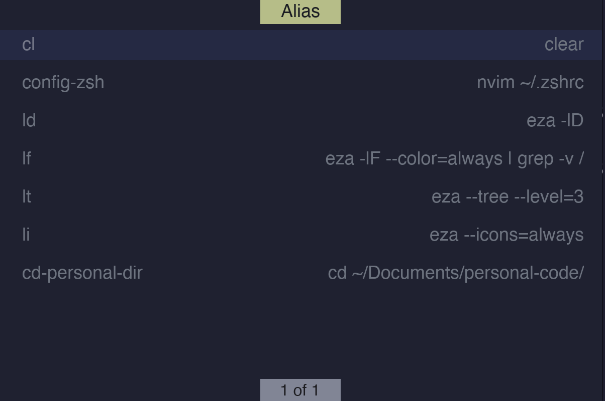

<h1 align="center">Aliscut</h1>

<p align="center">
Minimal CLI show alias in system, written in C++
</p>

<div align="center">
  
</div>

<br>

---

## Motivation

I usually define many aliases to avoid repeating long command-line instructions in the terminal. However, one day I opened the terminal and completely forgot what aliases I had created. I had to open the terminal configuration files and use cat just to check them, which became really annoying when I wanted to stay focused and work continuously. That frustration is exactly why this project exists.

---

## Features

- Show the aliases with the one command line
- Color support for terminals
- Support UI
- Movement like vim motions

---

## Install

### Dependencies and Build

#### Dependencies

**Linux (Ubuntu, Kali)** 
```bash
sudo apt update    # optional
sudo apt upgrade   # optional
sudo apt install cmake build-essential
```

**macOS** 
```bash
brew install gcc cmake make  # skip gcc if Xcode is installed
```

#### Build the Application

```bash
# Clone the repo
git clone git@github.com:NhanPhan159/aliscut.git
cd aliscut
mkdir build && cd build
```

**Option A — Build from source**

Install **cargo** first (Rust's build tool — see [rust-lang.org](https://www.rust-lang.org/tools/install)).

```bash
cmake --build .
make
```

**Option B — Use the pre-built Slint library** (Linux only)

Download the Slint library from the [releases page](https://github.com/slint-ui/slint/releases), then:

```bash
tar -xvf <slint-archive>
cd include && sudo mv slint /usr/local/include
cd ../lib && sudo mv cmake libslint_cpp.so /usr/local/lib
```

> **Note:** `libslint_cpp.so` filename may vary by architecture.

Then build:
```bash
cmake --build .
make
```

**Option B — Use the bundled archive** (macOS only)

In `CMakeLists.txt`, uncomment:
```cmake
# list(APPEND CMAKE_MODULE_PATH "${CMAKE_CURRENT_SOURCE_DIR}/cmake")
```

Then:
```bash
tar -xvf install.tar.gz
cmake --build .
make
```

#### Move to PATH

```bash
sudo mv aliscut /usr/local/bin/
```

---
## Usage

```bash
# Basic usage, this show the app, you can move like using vim motions, "q" to quit, <Enter> to show the command in terminal
aliscut

# Show simple table aliases to quick look
aliscut -s
```
---

## License

MIT License © 2026 Nhan Phan  
See [LICENSE](LICENSE) for more information.

---
